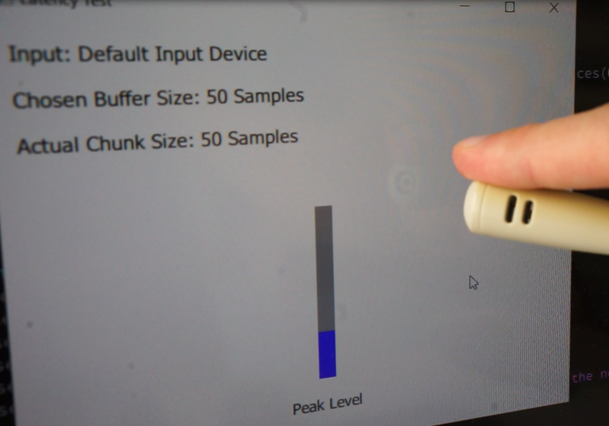

## Investigating the latency of QAudioInput

### Goal

Reducing the time between a sound and a DMX value being sent while using the [Sound2Light Tool](https://github.com/ETCLabs/Sound2Light) together with an Eos Console.
To be able to better optimize the latency of the the involved QAudioInput, a minimal working example was created that allows to measure the time between a sound and receiving a value from QAudioInput.

### Measurement Procedure

A video is captured with a microphone in the foreground and the application window in the background. Then the frames are counted between tapping on the mic and seeing a change in the UI. The 	measuring tolerance is 16ms with this technique (when capturing with 60 fps).

## Initial Insights

### Theoretic Worst Case Latency

(trying to detect low frequency using FFT, using Qt default values, 44.1 kHz sampling rate)

| Source | Latency |
| --- | --- |
| *Initial Sound* | begin |
| A/D Conversion and Hardware Buffer | ? ms |
| Software Buffer in USB and Device Driver | ? ms |
| QAudioInput Buffer (default: ~1764 Samples) | 40 ms |
| Fill whole FFT Window (2048 Samples) | 46 ms |
| Refresh Timer (60 Hz) | 16 ms |
| Computation Time | <5 ms |
| Sending OSC over Network | <5 ms |
| DMX or GUI Update (~40 Hz) | 25 ms |
| *Change in brightness of light* | end |

-> Theoretic Worst Case Latency: **? + 137 ms**

### Actual Measurement

Time between sound and UI change in Eos software (Sound2Light 0.0.2.1.0.9 (Windows 10) and Eos 2.7.1 (macOS) running on different computers, connected using ethernet)

| Setup | Latency |
| --- | --- |
| S2L, Win 10, cheap USB Soundcard | 216 ms |
| Luminosus, Win 10, cheap USB Soundcard | 160 ms |
| Luminosus, Linux, ALSA, cheap USB Soundcard | 160 ms |

(There was no delay between the UI change in Sound2Light and Eos visible -> the network connection seems to be negligible.)

### Conclusion

The actual measurement is close to the theoretic minimum. Therefore the problem seems to be the buffer in QAudioInput and in the sound card driver. This is why the minimal example in this repository was created.

## QAudioInput Measurements

### Effect of `QAudioInput::bufferSize`

Win 10, cheap USB soundcard

| Chosen Buffer Size (Samples) | Actual Chunk Size | Visual Latency |
| --- | --- | --- |
| 10 | 10 | 116 ms |
| 50 | 50 | 100 ms |
| 100 | 100 | 100 ms |
| 5000 | 1000 | 83 ms |
| 20000 | 4000 | 150 ms |

-> the delay between the sound and receiving the data from QAudioInput **doesn't seem to correlate** with the buffer size and the **minimum possible latency of 83ms** seems already quite high

Next step: test with higher quality sound card and ASIO driver
