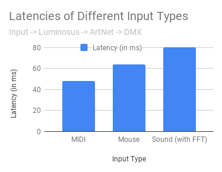
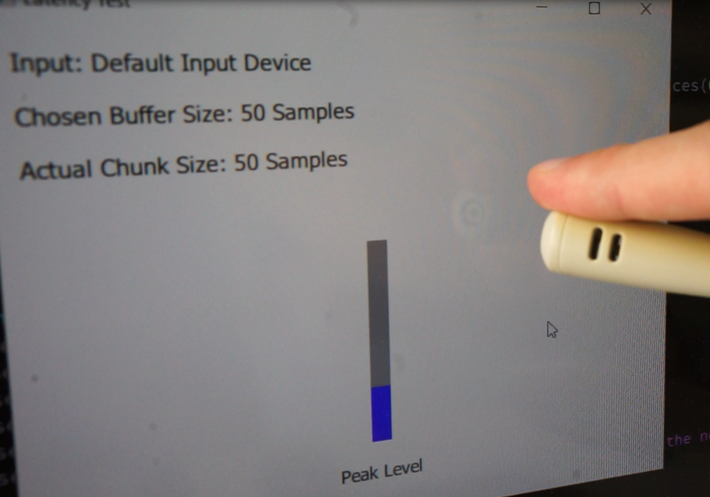

## Reducing the Latency of the [Sound2Light Tool](https://github.com/ETCLabs/Sound2Light)

### Goal

Reducing the time between a sound and a DMX value being sent while using the [Sound2Light Tool](https://github.com/ETCLabs/Sound2Light) together with an Eos Console. The goal is to get from the current >300 ms to something like 80 ms.

### Result

After many measurements it became clear, that the high latency was a result of a program bug. It was only introduced in one of the latest version (0.0.2.1.0.7) and could be fixed by changing two lines of code [(see this commit)](https://github.com/luminosuslight/Sound2Light/commit/9c751e0f64f000bda47db181dcea88bd864e4b4d). The latency is now back to under 80 ms (Windows 10, cheap USB microphone, Sound2Light newer than 0.0.2.1.0.9).

## Insights from the Measurements

### Measurement Procedure

A video is captured with a microphone in the foreground and the application window in the background. Then the frames are counted between tapping on the mic and seeing a change in the UI. The measuring tolerance is 16ms with this technique (when capturing with 60 fps).

**Input and Display Lag:** With this measurement technique, the input and display lag needs to be considered. They are higher than initially though and can influence the measurement dramatically. 

The time between a mouse click or a key press and a UI change in this setup is ~128 ms. The time between a mouse click and a light turning on (connected via ArtNet / Ethernet and DMX) is ~80 ms. This means that the display lag seems to be at least 48ms. This time **was removed from all measurements below**.

### Theoretic Worst Case Latency

when trying to detect low frequency using FFT, using Qt default values, 44.1 kHz sampling rate

| Source | Latency |
| --- | --- |
| *Initial Sound* | begin |
| A/D Conversion and Hardware Buffer | ? ms |
| Software Buffer in USB and Device Driver | ? ms |
| QAudioInput Buffer (default: ~1764 Samples) | 40 ms |
| Fill whole FFT Window (2048 Samples) | 46 ms |
| Refresh Timer (60 Hz) | 16 ms |
| Computation Time | <5 ms |
| Sending OSC over Network | <5 ms |
| DMX or GUI Update (~40 Hz) | 25 ms |
| *Change in brightness of light* | end |

-> Theoretic Worst Case Latency: **? + 137 ms**

### Actual Measurement

Time between sound and UI change in Eos software (Sound2Light 0.0.1.1.0.16 (Windows 10) and Eos 2.7.1 (macOS) running on different computers, connected using ethernet)

| Setup | Latency |
| --- | --- |
| S2L, Win 10, cheap USB Soundcard |  168 ms |
| Luminosus, Win 10, cheap USB Soundcard | 112 ms |
| Luminosus, Linux, ALSA, cheap USB Soundcard | 112 ms |

(There was no delay between the UI change in Sound2Light and Eos visible -> the network connection seems to be negligible.)

### Conclusion

The actual measurement is below to the theoretic maximum. Therefore the problem seems to be the buffer in QAudioInput and in the sound card driver. This is why the minimal example in this repository was created. (**Edit:** This measurement wasn't done with the newest Sound2Light version, which is why the latency was ok and not over 300ms.)

## QAudioInput Measurements

To be able to better optimize the latency of the the involved QAudioInput, a minimal working example was created that allows to measure the time between a sound and receiving a value from QAudioInput. The code is in the `src_*` folders.

### Effect of `QAudioInput::bufferSize`

- Latency: time between tapping on the mic and seeing a change in the UI
- Software shows peak value of last received data, no other computation is done (especially no FFT)
- Win 10: cheap USB soundcard
- macOS: internal Microphone
- Buffer Sizes in Samples
- Actual Chunks: amount of samples received per emitted readReady() signal

| Chosen Buffer Size | Actual Chunks (Win 10) | Latency (Win 10) | Actual Chunks (macOS) | Latency (macOS) |
| --- | --- | --- | --- | --- |
| 10 | 10 | 68 ms | 14 | 52 ms |
| 50 | 50 | 52 ms | 50 | 52 ms |
| 100 | 100 | 52 ms | 100 | 52 ms |
| 5000 | 1000 | 35 ms | 4096 | 128 ms |
| 20000 | 4000 | 102 ms | 4096 | 96 ms |

-> the delay between the sound and receiving the data from QAudioInput **doesn't seem to correlate** with the buffer size

### Testing with Low Latency ASIO driver

To be able to use the ASIO driver, that claims to have latencies as low as 10ms, the example program needed to be rewritten with RtAudio instead QAudioInput (see `src_rtaudio` folder).

The first measurements showed no benefit of using ASIO and even a slight increase in latencies. Later it was clear, that this was mainly caused by measurement tolerances and the display lag.

In the end the RtAudio backend idea was discarded, as the Sound2Light Tool with the mentionend bug fix already has quite low latencies again.
